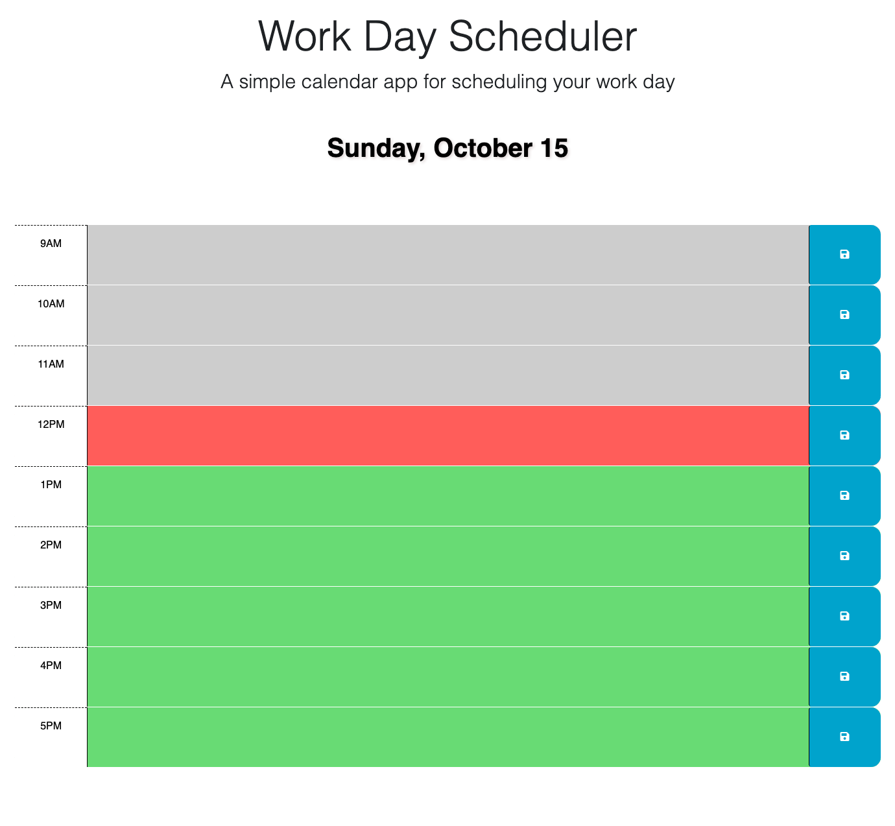
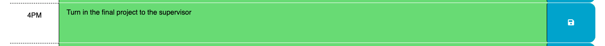

# [Work Day Scheduler](https://jmorante89.github.io/Work-Day-Scheduler-Project/)

  ## Table of Contents
  - [Description](#description📝)
  - [Installation](#installation💻)
  - [Usage](#usage👨‍💻)
  - [Features](#features🎁)
  - [Credits](#credits📣)
  - [Resources](#resources🛠️)
  - [License](#licenses🔍)

  ## Description📝
The Work Day Scheduler is a user-friendly calendar app designed for managing events from 9am to 5pm. It aims to help busy individuals effectively organize their daily schedules. Users can easily add and save important events, and time blocks are color-coded to show past, present, and future periods. The project addresses the need for a convenient daily activity planner. Day.js library was utilized in the project for browser-based date and time manipulation, enhancing its dynamic and responsive features.

  ## Installation💻
  The provided URL will redirect users to a user-friendly website, obviating the need for any user-initiated installations. This application supports most browsers.
  [Live Demo Link](https://jmorante89.github.io/Work-Day-Scheduler-Project/)

  ## Usage👨‍💻
  ### Homepage will display: Current day, Current time(highlighted in red), and Avalilable hours(highlighted in Green)

  ### Click on any time block to add your event. Then click the white save button to the right to save it to local storage.

  ### All saved events will display on browser, even if page is refreshed.  

  ## Features🎁
    -Displays current date on top of application.  
    -Easy UI to input daily calender Events.  
    -Fluid color blocks to facilitate time tracking.

  ## Credits📣
  - Daniel Morante 
  [Github Profile JMorante89](https://github.com/JMorante89)

  ## Resources🛠️
  - [The Coding Bootcamp, starter code](https://github.com/coding-boot-camp/crispy-octo-meme)
  - GWU tutoring
  - [Google Font](https://fonts.google.com/specimen/Open+Sans)
  - The project made use of the following APIs to aid in its development:
    - [jQuery](https://jquery.com/)
    - [Bootstrap](https://getbootstrap.com/)
    - [Day.js](https://day.js.org/)

  ## Licenses🔍
     

